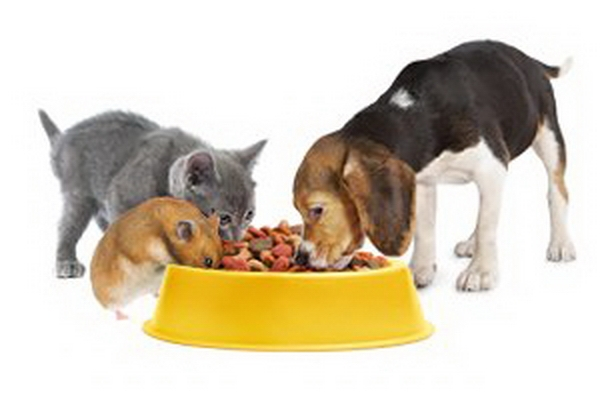

# Корма для животных

## Сухие корма

- **Royal Canin** — для собак мелких пород
- **ProPlan** — для активных собак
- **Hill's** — лечебные корма

## Влажные корма

- **Felix** — для кошек (паучи)
- **Sheba** — премиум-класс
- **Gourmet** — для привередливых кошек

## Как выбрать корм?

1. Определите возраст животного
2. Учтите породу и размер
3. Обратите внимание на состав
4. Проконсультируйтесь с ветеринаром

## Рекомендации

> Сухой корм должен храниться в герметичной упаковке не более месяца после вскрытия.

| Тип корма | Срок хранения | Цена за кг |
|-----------|---------------|------------|
| Сухой | 12 месяцев | 500-1500 ₽ |
| Влажный | 24 месяца | 200-500 ₽ |

[← Назад к товарам](/products/)